# FloodNet 8 周 Codex 实验执行计划

> 执行周期：2026-06-25 至 2026-08-19  
> 当前前提：完整 FloodNet supervised 数据已接入，官方 1445/450/448 split 成为主协议；代码闭环已完成，四图门尚未执行
> 主要算力：单张约 24GB GPU  
> 目标强度：IGARSS 级完整证据链  
> 运行策略：有边界的自适应，所有路线调整先记录后执行

## 1. 文档用途

本文件是后续 Codex 跨线程执行实验的主控制计划。任何新线程或远程机器会话开始时，应先读取 `AGENTS.md`，再按其中规定的顺序读取持久研究记忆：

1. `outputs/floodnet_handoff_state.md`；
2. `outputs/floodnet_decision_log.md`；
3. `outputs/floodnet_codex_8week_execution_plan.md`；
4. `outputs/floodnet_idea_experiment_spec.md`；
5. `outputs/floodnet_experiment_registry.csv`；
6. `outputs/floodnet_dataset_audit.md`。

每次实验会话结束前必须：

1. 将完成或失败的 run 追加到 registry；
2. 将方法或路线决定追加到 decision log；
3. 更新 handoff state 中的当前阶段、最新证据、阻塞项和下一步；
4. 保存精确命令、配置文件、代码提交和输出路径；
5. 不覆盖旧实验、旧配置或旧模型。

---

## 2. 总体里程碑

| 里程碑 | 截止日期 | 最低交付 |
|---|---|---|
| M1 数据与监督基线 | 2026-07-01 | 可复现 Full Supervision SegFormer-B0 与可信评测 |
| M2 半监督基线 | 2026-07-08 | 5%/10% Labeled Only、Pseudo Label、Mean Teacher |
| M3 层次分解 | 2026-07-15 | Object-State 指标与消融 |
| M4 边界建模 | 2026-07-22 | Boundary F1 与边界一致性实验 |
| M5 关系与结构筛选 | 2026-07-29 | 相同 Coverage 伪标签质量优势 |
| M6 完整核心实验 | 2026-08-05 | 多比例主表、强基线、主消融 |
| M7 扩展与效率 | 2026-08-12 | AIFloodSense 或主实验补强、效率与可视化 |
| M8 论文级结果包 | 2026-08-19 | 三种子统计、图表、结果分析、投稿审查 |

---

## 3. 工程与实验约定

### 3.1 默认工程结构

实验工程直接位于本仓库，默认使用：

```text
floodnet-structure-aware-ssl/
├── configs/
├── data/
├── datasets/
├── models/
├── losses/
├── trainers/
├── metrics/
├── scripts/
├── tests/
├── runs/
└── reports/
```

原始 FloodNet 数据不得复制、移动或修改。通过配置项 `DATA_ROOT` 指向现有数据路径。

本地 Windows 数据源当前为七个 Track 1 ZIP 分包。合并解压后的数据根目录必须位于仓库之外；服务器使用独立数据盘路径。

### 3.2 配置优先

所有实验必须由配置文件驱动。配置至少包含：

- 数据根目录与 split 文件；
- 类别顺序和颜色映射；
- 标注比例和种子；
- 模型与骨干；
- 输入尺寸；
- batch size 和梯度累积；
- 优化器、学习率、调度器；
- 损失权重；
- EMA 参数；
- 伪标签阈值和 Coverage 策略；
- 输出目录。

不得为单次实验在训练代码中硬编码超参数。

### 3.3 Run ID

格式：

```text
YYYYMMDD_method_labelpct_seed_variant
```

示例：

```text
20260704_mean_teacher_05_s1_base
20260726_ours_10_s2_relation_ring5
```

每个 run 必须具有独立输出目录。

### 3.4 可复现性

- 固定 Python、NumPy、PyTorch 和 CUDA 随机种子；
- 记录依赖版本和 GPU 型号；
- 保存最终解析后的完整配置；
- 保存最佳和最后一个 checkpoint；
- 保存验证/测试逐类别指标；
- 测试集只在配置冻结后运行。

### 3.5 资源默认值

- 初始 crop：512×512；
- 单卡 24GB；
- 混合精度：开启；
- 有效 batch size：通过梯度累积保持至少 8；
- 初始骨干：SegFormer-B0；
- TensorBoard + CSV 本地记录；
- 若单个 run 超时，优先减少训练 epoch 或验证频率，不改变测试协议。

---

## 4. Week 1：数据审计与监督基线

**日期：2026-06-25 至 2026-07-01**

### 4.0 截至 2026-06-27 的进度

- 已完成七包安全合并、全量审计和近重复审查；
- 已冻结主协议 `splits/floodnet_supervised_v1/`（Train/Validation/Test = 1445/450/448）；
- 已完成 Dataset、指标、同步空间增强和滑窗概率融合；
- 配置、SegFormer 适配器、监督训练/验证、checkpoint 和四图验收代码已完成；
- 39 个单元测试与真实三子集 CPU DataLoader smoke test 已通过；
- 统一模型输出、`build_model` factory 和默认禁用的多头网络骨架已实现；
- 服务器只读环境检查、checkpoint 滑窗评估和 run 汇总脚本已实现；
- 尚未运行四图像过拟合或任何正式训练。
- 当前下一步是在服务器环境安装依赖后执行新 supervised 协议下的四图过拟合门。

### 4.1 目标

先在本地建立可信数据管线、评测实现和可训练工程，再在付费 GPU 上运行 Full Supervision SegFormer-B0 基线。Week 1 结束前不实现关系模块。

### 4.2 任务

1. 将七个 ZIP 合并解压到仓库外的单一只读数据根目录；
2. 枚举完整 supervised 数据的 1445 张 Train、450 张 Validation、448 张 Test 及其 mask；
3. 检查图像-掩码一一对应；
4. 确认掩码格式、颜色表和类别 ID；
5. 统计每类像素数、图像覆盖数和空类别；
6. 检查重复图像、连续航拍近重复和潜在 split 泄漏；
7. 随机可视化至少 30 组图像/掩码；
8. 生成并版本化官方 supervised manifest；旧 278/60/60 仅保留为历史产物；
9. 实现 FloodNet Dataset 和统一空间增强；
10. 实现 mIoU-9、mIoU-10、Macro-F1、分类别 IoU；
11. 实现 Building/Road 合并 IoU 和 State F1；
12. 实现边界真值生成和 Boundary F1 单元测试；
13. 实现滑动窗口测试和整图概率融合；
14. 在 CPU 或本地可用设备完成加载、前向、反向和四图像过拟合测试；
15. 本地门通过后租用 GPU，运行 SegFormer-B0 Full Supervision；
16. 重复同配置短跑两次，确认指标波动合理。

### 4.3 测试

- 所有 mask ID 必须位于合法类别范围；
- 随机空间增强后图像与掩码保持对齐；
- 手工构造小掩码验证 IoU、F1 和边界指标；
- 四张训练图像必须可以被模型明显过拟合；
- 同一 checkpoint 重复测试结果完全一致；
- 训练、验证、测试 ID 集合无交集。

### 4.4 交付

- 数据审计报告；
- 类别统计 CSV；
- 可视化样本图；
- 1445 张 official Train 全监督基线配置与 checkpoint；
- 首份指标报告；
- 精确训练与测试命令。

### 4.5 阶段门 M1

必须同时满足：

- 数据完整且无可见泄漏；
- 固定 278/60/60 split 已版本化；
- 指标通过单元测试；
- 四图像过拟合测试通过；
- 训练损失正常下降；
- 验证和测试输出可重复；
- 分类别结果数量级与已发表 FloodNet 结果不存在明显异常。

若失败：暂停后续开发，优先修复数据映射、插值方式、Ignore ID、滑窗拼接和评测代码。

---

## 5. Week 2：少标注与基础半监督基线

**日期：2026-07-02 至 2026-07-08**

### 5.1 目标

建立标签效率曲线和稳定的 EMA 教师-学生训练框架。

### 5.2 数据划分

1. 以 278 张 Local Train 为分母，为 5%、10%、25% 生成多标签分层 split；1% 仅作可选压力测试；
2. 每个比例固定三个种子；
3. 优先保证受淹建筑和受淹道路获得基本覆盖；
4. 保存图像 ID 和每类覆盖统计；
5. 无标签池由 1047 张官方无标签图像和 Local Train 中被隐藏标签的图像组成；
6. Local Validation/Test 永不进入无标签池；
7. 另建 DeepLabV3+/EfficientNet-B3 的 398/1047 历史逻辑复现。

### 5.3 实验顺序

1. 10% Labeled Only，seed 1；
2. 5% Labeled Only，seed 1；
3. 10% Pseudo Label，seed 1；
4. 10% Mean Teacher，seed 1；
5. 5% Pseudo Label，seed 1；
6. 5% Mean Teacher，seed 1；
7. 流程稳定后补 25%；若关键类别覆盖允许，再做可选 1% 压力测试；
8. 最后补 seed 2、3。

### 5.4 必须记录

- 最终分割指标；
- 每类伪标签 Precision、Recall、IoU；
- 伪标签 Coverage；
- 教师与学生验证 mIoU；
- 伪标签质量随 epoch 的变化；
- 训练耗时和峰值显存。

### 5.5 阶段门 M2

至少在 5% 或 10% 设置下：

- Mean Teacher 稳定优于 Labeled Only；
- 三个种子中至少两个具有相同趋势；
- 伪标签质量随训练没有持续恶化。

若失败，按顺序检查：

1. 教师初始化与 EMA 更新；
2. 弱强增强几何对齐；
3. 伪标签阈值和 Ignore 处理；
4. 学习率与无监督损失权重；
5. 类别不平衡和裁剪策略；
6. 测试代码。

M2 未通过前不得实现关系模块。

---

## 6. Week 3：物体-状态层次分解

**日期：2026-07-09 至 2026-07-15**

### 6.1 目标

验证层次标签是否提高物体定位和受淹状态识别。

### 6.2 实现

1. 创建原标签到八类物体身份的确定性映射；
2. 创建仅建筑/道路有效的 Flooded/Non-flooded 状态标签；
3. 实现物体身份头；
4. 实现洪水状态头；
5. 实现层次组合概率；
6. 实现主语义头与层次组合的 JS 一致性；
7. 实现 Building/Road IoU 和 State F1；
8. 将层次一致性加入教师伪标签评分的可选分量。

### 6.3 实验

- Baseline；
- + Object head；
- + Object + State heads；
- + Hierarchical consistency；
- 状态损失类别权重；
- 普通随机裁剪与类别感知裁剪。

优先在 10% seed 1 上调试，冻结后运行 5% seed 1 和 10% 三种子。

### 6.4 阶段门 M3

满足至少一项且无明显副作用：

- State Macro-F1 稳定提高；
- Affected mIoU 稳定提高；
- Flooded building 或 Flooded road IoU 稳定提高。

若仅 Building/Road IoU 提高而 State F1 不提高：

1. 调整状态区域采样；
2. 调整 Flooded/Non-flooded 类别权重；
3. 检查状态 Ignore 区域；
4. 不增加新头。

若调整后仍无效，删除状态分解主张，只保留物体辅助监督。

---

## 7. Week 4：边界监督与跨任务一致性

**日期：2026-07-16 至 2026-07-22**

### 7.1 目标

验证边界分支是否真实改善建筑和道路轮廓，并为结构伪标签筛选提供有效信号。

### 7.2 实现

1. 支持 1、3、5、7 像素边界宽度；
2. 边界头使用浅层高分辨率特征；
3. BCE + Dice 边界损失；
4. 可微 SoftGradient；
5. 分割-边界一致性损失；
6. Boundary F1；
7. 从教师预测计算边界一致性评分；
8. 边界可视化和误差热图。

### 7.3 实验

- 无边界；
- 仅边界辅助头；
- 边界辅助头 + 一致性；
- 不同边界宽度；
- 不同边界损失；
- 边界分支只训练使用 vs 推理保留。

### 7.4 阶段门 M4

- Boundary F1 稳定提高；
- Flooded building/road IoU 不明显下降；
- 边界一致性评分与真实边界错误存在合理相关性。

若 Boundary F1 不提高：

1. 检查边界真值生成和插值；
2. 调整边界宽度；
3. 调整类别不平衡损失；
4. 比较浅层和融合特征。

若仍无效，边界头不纳入完整版，并记录失败。

---

## 8. Week 5：关系模块与结构可靠性评分

**日期：2026-07-23 至 2026-07-29**

### 8.1 目标

验证内外环形上下文是否改善受淹状态，并在相同 Coverage 下提高伪标签质量。

### 8.2 实现顺序

1. 建筑和道路软掩码；
2. MaxPool 膨胀和外部环形区域；
3. 内部归一化池化；
4. 外部上下文归一化池化；
5. 内外特征差值；
6. 边界特征融合；
7. 关系状态头；
8. 状态-关系 JS 一致性；
9. 关系权重 ramp-up；
10. 完整结构可靠性评分；
11. 类别自适应阈值；
12. 相同 Coverage 评价工具。

### 8.3 替换实验

- 无关系模块；
- 3×3 卷积；
- 普通局部注意力；
- 仅内部特征；
- 内部 + 外部环；
- 内部 + 外部环 + 边界；
- 环宽 3/5/7；
- 多尺度环。

### 8.4 伪标签筛选实验

- Confidence only；
- + Hierarchy；
- + Boundary；
- + Relation；
- Full score。

在 Coverage = 20%、40%、60%、80% 下比较：

- 全部类别 PL mIoU；
- Flooded building Precision/IoU；
- Flooded road Precision/IoU；
- 最终学生 Affected mIoU。

### 8.5 阶段门 M5

同时满足：

- 关系模块在 State F1 或 Affected mIoU 上优于 3×3 卷积；
- 完整评分在相同 Coverage 下优于 Confidence only；
- 优势不只发生在一个种子；
- 训练稳定，无持续 NaN 或分支坍塌。

若不满足：

- 删除关系模块；
- 保留已验证的层次与边界机制；
- 将论文收缩为层次+边界半监督方案；
- 在 decision log 记录完整证据。

---

## 9. Week 6：完整核心实验与强基线

**日期：2026-07-30 至 2026-08-05**

### 9.1 目标

冻结方法结构，完成主结果、强基线和核心消融。

### 9.2 任务

1. 完成 UniMatch 复现或兼容实现；
2. 若 UniMatch 无法可靠复现，完成 CPS 或 ST++ 并记录原因；
3. 冻结完整方法超参数；
4. 运行 5%、10%、25%；核心完成后再决定是否运行可选 1%；
5. 优先完成 5%、10% 三种子；
6. 完成主模块消融；
7. 完成结构筛选消融；
8. 完成关系替换实验；
9. 生成标签效率曲线；
10. 汇总均值与标准差。

### 9.3 阶段门 M6

最低投稿条件：

- 5% 和 10% 均优于 Labeled Only；
- 至少一个设置优于 Mean Teacher 和强基线；
- 至少一个关键受灾类别稳定获益；
- 结构筛选具有直接伪标签质量证据；
- 主消融与方法主张一致。

若未满足：

1. 不进入 AIFloodSense 扩展；
2. 定位失败模块；
3. 收缩方法；
4. 补强核心对比和训练协议；
5. 重新评估是否仍达到投稿强度。

---

## 10. Week 7：外部验证、效率与失败分析

**日期：2026-08-06 至 2026-08-12**

### 10.1 路线 A：核心方法通过 M6

1. 审计 AIFloodSense 数据；
2. 训练 Building 或 Flood+Building 预训练；
3. 在 FloodNet 5%/10% 上比较初始化；
4. 合并 FloodNet 建筑类别，在 AIFloodSense 测试 Building IoU；
5. 记录域差异和负迁移；
6. 测量参数量、FLOPs、显存和 FPS；
7. 比较训练辅助头保留/移除；
8. 生成成功、困难和失败案例。

### 10.2 路线 B：核心方法未通过 M6

1. 不开展 AIFloodSense；
2. 完成收缩方案三种子；
3. 补齐相同 Coverage 和关键类别分析；
4. 修复最强失败点；
5. 重新完成主表和消融；
6. 明确论文能支持和不能支持的结论。

### 10.3 阶段门 M7

- 主方法最终结构确定；
- 训练和推理成本完整；
- 所有定性图可追溯到具体 run；
- AIFloodSense 结果不被夸大；
- 失败案例具有解释，而非隐藏。

---

## 11. Week 8：论文级结果包

**日期：2026-08-13 至 2026-08-19**

### 11.1 结果复跑

1. 对所有主表结果完成三个种子；
2. 固定代码提交和依赖；
3. 使用最佳验证 checkpoint 统一测试；
4. 计算均值、标准差和 95% 置信区间；
5. 复核每个结果与 registry 一致。

### 11.2 图表

1. 主结果表；
2. 关键受灾类别表；
3. 主消融表；
4. 伪标签相同 Coverage 表；
5. 标签效率曲线；
6. Precision-Coverage 曲线；
7. 方法流程图；
8. 定性比较；
9. 失败案例；
10. 效率表。

### 11.3 写作素材

1. 实验设置草稿；
2. 主结果分析；
3. 伪标签质量分析；
4. 边界与状态分析；
5. 消融分析；
6. 局限性；
7. Claim-Evidence 最终核对；
8. IGARSS 投稿可行性判断。

### 11.4 阶段门 M8

必须满足：

- 所有主结论有数字和对应 run；
- 无测试集调参；
- 三种子统计完整；
- 结果可由固定配置复现；
- 失败模块已删除或明确说明；
- 文稿没有超出实验支持的主张。

---

## 12. 自适应决策树

```mermaid
flowchart TD
    A["监督基线可信？"] -->|否| A1["修复数据/指标/训练"]
    A -->|是| B["Mean Teacher优于Labeled Only？"]
    B -->|否| B1["修复半监督协议，不加新模块"]
    B -->|是| C["层次分解改善State或Affected指标？"]
    C -->|否| C1["调整采样/损失；仍失败则删除状态主张"]
    C -->|是| D["边界分支改善Boundary F1？"]
    D -->|否| D1["修复边界实现；仍失败则删除边界模块"]
    D -->|是| E["关系模块优于普通上下文？"]
    E -->|否| E1["收缩为层次+边界方案"]
    E -->|是| F["相同Coverage下结构筛选更准？"]
    F -->|否| F1["删除结构筛选主张或重构评分"]
    F -->|是| G["冻结完整方法，补强基线与泛化"]
```



---

## 13. 跨线程交接协议

### 13.1 新线程启动

Codex 应先输出简短状态摘要：

- 当前周与阶段门；
- 最近一次成功 run；
- 最近一次失败 run；
- 当前最强配置；
- 下一项实验；
- 是否存在阻塞。

### 13.2 每个实验前

1. 检查 registry 是否已有相同配置；
2. 检查 decision log 是否允许该路线；
3. 验证 split、seed 和配置；
4. 明确本 run 对应哪个论文主张；
5. 在 handoff state 标记为 running。

### 13.3 每个实验后

1. 注册 run；
2. 保存指标；
3. 比较阶段门；
4. 记录异常和失败；
5. 更新下一步；
6. 不自动删除失败权重和日志。

### 13.4 阻塞处理

只有满足以下条件才视为真正阻塞：

- 同一问题经过至少三次不同的安全排查仍无法继续；
- 缺失必要数据、权限、GPU或用户选择；
- 继续尝试无法产生新信息。

否则继续进行低成本诊断或切换到不依赖该阻塞的实验。

---

## 14. 最终验收标准

- [ ] 三种子 Mean±Std；
- [ ] 5% 和 10% 优于 Labeled Only；
- [ ] 至少一个设置优于 Mean Teacher 和一个强基线；
- [ ] 至少一个关键受灾类别稳定获益；
- [ ] 相同 Coverage 下结构筛选提高 PL mIoU；
- [ ] Boundary F1 与 State F1 支持方法主张；
- [ ] 主模块消融完整；
- [ ] 效率数据完整；
- [ ] 成功与失败案例完整；
- [ ] 配置、split、日志、权重和代码提交可追溯；
- [ ] 若完整关系方法失败，交付经验证的收缩方案；
- [ ] 所有论文表述与实验事实一致。
