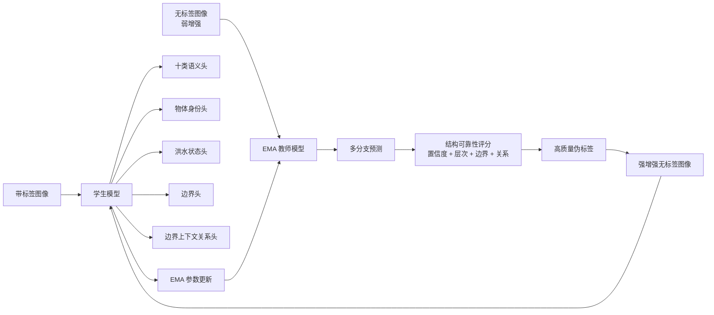

# FloodNet 少标注洪灾语义分割：研究与实验方案

> 文档状态：研究规格 v1.0  
> 创建日期：2026-06-24  
> 目标成果：IGARSS 级别完整会议论文证据链  
> 主要数据集：FloodNet  
> 扩展数据集：AIFloodSense  
> 暂不纳入主实验：UrbanSARFloods

## 1. 执行摘要

本研究面向少量像素级标注和大量无标签无人机洪灾影像，拟提出一种融合层次语义、边界信息与局部空间关系的半监督语义分割方法。方法的核心判断是：洪灾伪标签的可靠性不能只由单像素预测置信度决定，还应检查物体身份、洪水状态、目标边界及其周围环境之间是否相互一致。

研究以 FloodNet 十类语义分割为主要任务。模型保留标准十类输出，同时将受淹建筑、未受淹建筑、受淹道路和未受淹道路分解为“物体身份”和“洪水状态”两个属性；通过辅助边界分支学习建筑和道路轮廓；通过物体内部与外部环形上下文判断受淹状态；最终利用语义置信度、层次一致性、边界一致性和关系一致性共同筛选无标签数据的伪标签。

论文能否成立，取决于一条明确的证据链：

1. 在相同伪标签覆盖率下，结构可靠性评分是否优于单纯置信度筛选；
2. 提升是否稳定出现在受淹建筑、受淹道路及其边界，而非仅来自多数类别；
3. 层次分解、边界监督和关系建模是否分别产生可测量且互补的收益；
4. 在 5% 和 10% 标注设置下，完整方法是否优于监督基线、Mean Teacher 和至少一个强半监督基线；
5. 外部洪灾数据是否能够改善跨地区泛化，或至少明确揭示域差异。

---

## 2. 研究背景与问题定义

### 2.1 应用背景

洪灾发生后，应急部门不仅需要识别洪水范围，还需要快速判断哪些建筑和道路受到影响。像素级语义分割能够为受淹建筑统计、道路通行性评估、救援路线规划和资源分配提供精细空间信息。低空无人机具有部署灵活、采集速度快和空间分辨率高的特点，因此适合局部洪灾精细评估。

然而，无人机可以在短时间内采集大量高分辨率图像，逐像素描绘建筑、道路和灾害状态却需要大量人工时间。FloodNet 原论文报告单张图像的人工标注平均约需一小时。真实灾害中不可能等待全部图像完成标注后再训练模型，因此“少量带标签图像 + 大量无标签图像”比完整监督更符合实际部署条件。

### 2.2 技术挑战

传统半监督语义分割通常使用教师模型生成伪标签，并依据最大类别概率选择可信像素。该策略在 FloodNet 上面临四个问题：

1. **类别极不平衡。** 受淹建筑和受淹道路远少于树木、草地和未受淹道路，统一置信度阈值容易删除少数类别伪标签。
2. **边界噪声严重。** 建筑、道路和小目标经过下采样后容易出现侵蚀、粘连和断裂，内部高置信度不能保证轮廓正确。
3. **受淹状态依赖上下文。** 建筑屋顶本身在受淹前后可能十分相似，判断依据往往位于建筑或道路边界附近。
4. **确认偏差。** 教师的高置信错误会被学生重复学习，并通过 EMA 更新进一步固化。

### 2.3 精确研究问题

本研究拟回答：

> 在仅有少量 FloodNet 像素级标注的条件下，如何利用物体身份、洪水状态、边界完整性和局部空间上下文，对伪标签进行结构可靠性建模，从而提高受淹建筑和受淹道路的分割质量？

### 2.4 数据标签限制

FloodNet 的 `Water` 类主要表示河流、湖泊等自然水体，不是完整、独立的洪水水面掩码。因此，主方法不得声称直接使用 FloodNet 洪水真值计算建筑与洪水的接触关系。

主方法学习的是：

> 建筑或道路边界外部的局部视觉上下文是否支持其受淹状态。

只有在引入 AIFloodSense 的 `Flood` 掩码或补标少量 FloodNet 洪水区域后，才可将其表述为显式洪水证据。

---

## 3. 三个数据集在研究中的角色

| 数据集 | 主要模态与规模 | 标签特点 | 本研究角色 |
|---|---|---|---|
| FloodNet-Supervised_v1.0 | UAV RGB；1445 张 Train、450 张 Validation、448 张 Test，均有分割 mask | 受淹/未受淹建筑、道路及其他场景类别 | 主训练、验证、测试与全部核心结论 |
| AIFloodSense | 全球航拍 RGB；470 张；230 次事件；64 国 | Flood、Building、Sky、Background | 外部预训练、建筑公共类别测试、跨地区泛化 |
| UrbanSARFloods | 8 通道 Sentinel-1 SAR；8879 切片 | 未受淹、开放区域洪水、城市洪水 | 未来跨模态方向，不进入本轮主实验 |

### 3.1 为什么暂不联合 UrbanSARFloods

UrbanSARFloods 与 FloodNet 存在传感器模态、通道数、空间分辨率和标签体系的同时变化。将其纳入会把问题扩展为跨模态、跨尺度域适应，削弱当前“结构感知半监督分割”的主线。除非核心方法提前完成且时间充足，本轮不开展该扩展。

### 3.2 当前 FloodNet 版本限制

当前主数据版本已更新为 `FloodNet-Supervised_v1.0`。该版本共有 2343 张图像与 2343 张单通道分割 mask，官方 split 为 Train 1445、Validation 450、Test 448，三者均可用于对应训练/验证/最终评估。

旧 challenge release 的 398-mask 与 278/60/60 local split 保留为历史审计产物；后续主实验不再使用旧协议。少标注与半监督实验以 1445 张 official Train 为母集，按比例隐藏标签构造 labeled/unlabeled pool；Validation/Test 保持官方固定划分。

---

## 4. 直接相关工作的不足

### 4.1 早期 FloodNet 半监督论文

2021 年的 *Semi-Supervised Classification and Segmentation on High Resolution Aerial Images* 使用 398 张带标签和 1047 张无标签 FloodNet 训练图像。分割部分先比较 UNet/ResNet-34、PSPNet/ResNet-101 与 DeepLabV3+/EfficientNet-B3，再选择表现最好的 DeepLabV3+/EfficientNet-B3：先使用人工标签训练，随后生成伪掩码并逐渐提高伪标签损失权重。

该工作是本研究必须引用和对比的直接基线，但存在以下不足：

1. 监督 mIoU 为 52.04%，加入伪标签后为 52.23%，只提高 0.19 个百分点；
2. 未报告随机种子、标准差和显著性，提升可能处于训练波动范围内；
3. 受淹建筑 IoU 由 0.49 降至 0.48，未证明关键灾害类别稳定受益；
4. 伪标签主要采用最大概率类别，没有 EMA 教师、弱强增强或可靠性筛选；
5. 没有直接分析伪标签精度、覆盖率和分类别质量；
6. 没有利用“物体身份 + 洪水状态”的标签层次；
7. 没有边界监督和空间关系建模；
8. 受计算限制，仅按约 1:10 比例随机使用无标签数据生成伪掩码；
9. 只有一个标注比例和较薄的实验协议。

### 4.2 本研究与该工作的区别

| 维度 | 早期半监督论文 | 本研究 |
|---|---|---|
| 研究核心 | 使用伪标签利用无标签数据 | 建模洪灾伪标签的结构可靠性 |
| 伪标签依据 | 当前预测与渐增权重 | 置信度、层次、边界、关系一致性 |
| 标签建模 | 十类相互独立 | 物体身份与洪水状态分解 |
| 边界 | 未建模 | 边界监督与分割-边界一致性 |
| 空间关系 | 未建模 | 物体内部与外部环形上下文 |
| 少数类别 | 无专门机制 | 类别自适应阈值与关键类别指标 |
| 伪标签评价 | 无 | 精度、覆盖率、分类别质量和训练曲线 |
| 泛化 | 仅 FloodNet | 可扩展至 AIFloodSense |

本研究不能仅实现“EMA + 边缘头”。若物体-状态层次一致性和内外边界上下文均未得到实验支持，方法的新意将退化为普通伪标签改进。

---

## 5. 研究问题与可证伪假设

### RQ1：层次分解能否改善少数受灾类别？

**假设 H1：** 将受淹建筑和道路分解为物体身份与洪水状态后，模型能利用全部建筑和道路样本学习共享物体特征，因此提高 Flooded building/road IoU 和 Flooded 状态 F1。

**证伪条件：** Building/Road IoU 提高，但 State F1 和 Affected mIoU 无稳定改善。

### RQ2：边界监督能否改善关键轮廓？

**假设 H2：** 边界分支及分割-边界一致性能够提高建筑、道路和受淹类别的 Boundary F1，并减少道路断裂与相邻建筑粘连。

**证伪条件：** Boundary F1 无稳定提升，或提升以关键类别 IoU 明显下降为代价。

### RQ3：内外边界上下文能否改善受淹状态判断？

**假设 H3：** 物体内部特征与外部环形上下文的联合表示，比普通局部卷积、仅内部特征或通用注意力更适合预测建筑和道路受淹状态。

**证伪条件：** 关系模块与 3×3 卷积或普通局部注意力表现无显著差异。

### RQ4：结构一致性能否筛选更可靠的伪标签？

**假设 H4：** 在相同 Coverage 下，联合层次、边界和关系一致性的可靠性评分具有更高伪标签 mIoU，尤其提高受淹建筑和道路的伪标签 Precision。

**证伪条件：** 精度提升仅来自大幅减少 Coverage，或相同 Coverage 下不优于置信度筛选。

---

## 6. 方法总览

方法采用共享 SegFormer-B0 编码器。训练阶段包含五个输出：标准十类语义、物体身份、洪水状态、语义边界和边界上下文关系。推理阶段默认只保留十类语义头；辅助头是否保留由效率实验决定。

---

## 7. 问题形式化

带标签数据集：

\[
\mathcal{D}_L=\{(x_i,y_i)\}_{i=1}^{N_L},
\]

无标签数据集：

\[
\mathcal{D}_U=\{u_j\}_{j=1}^{N_U}.
\]

\(y_i\) 为 FloodNet 十类像素标签：

1. Background；
2. Building-flooded；
3. Building-non-flooded；
4. Road-flooded；
5. Road-non-flooded；
6. Water；
7. Tree；
8. Vehicle；
9. Pool；
10. Grass。

共享编码器提取多尺度特征：

\[
F_1,F_2,F_3,F_4=E_\theta(x).
\]

标准语义头输出：

\[
P^{sem}=H_{sem}(F_1,F_2,F_3,F_4).
\]

---

## 8. 模块一：层次化物体-状态分解

### 8.1 动机

Flooded building 与 Non-flooded building 共享建筑身份，Flooded road 与 Non-flooded road 共享道路身份。直接将四个类别独立学习，会浪费共享物体监督并加重少数类别困难。

### 8.2 物体身份头

将原标签映射为八类物体身份：

\[
\mathcal{C}_{obj}=
\{\text{background, building, road, water, tree, vehicle, pool, grass}\}.
\]

物体头输出：

\[
P^{obj}=H_{obj}(F).
\]

### 8.3 洪水状态头

状态头仅在建筑和道路像素上监督：

\[
\mathcal{C}_{state}=\{\text{flooded},\text{non-flooded}\}.
\]

\[
P^{state}=H_{state}(F).
\]

其他类别像素在状态损失中设为 Ignore。

### 8.4 层次组合

\[
P^{hier}(\text{flooded building})
=P^{obj}(\text{building})P^{state}(\text{flooded}),
\]

\[
P^{hier}(\text{non-flooded building})
=P^{obj}(\text{building})P^{state}(\text{non-flooded}),
\]

道路类别同理，其他类别直接继承物体头概率。通过 Jensen-Shannon 散度约束直接语义输出与层次组合输出：

\[
\mathcal{L}_{hier}
=D_{JS}(P^{sem},P^{hier}).
\]

### 8.5 可测技术优势

- Building/Road 身份 IoU；
- Flooded/Non-flooded 状态 Macro-F1；
- Flooded building/road 分类别 IoU；
- 语义头与层次组合之间的平均一致性。

---

## 9. 模块二：边界监督与跨任务一致性

### 9.1 边界真值

从语义标签自动生成边界，无需额外标注：

\[
E_{gt}=\operatorname{Dilate}(Y)-\operatorname{Erode}(Y).
\]

初始边界宽度设为 3 个训练像素，并在 1、3、5、7 像素上做敏感性实验。

### 9.2 边界头

边界头使用高分辨率浅层特征：

\[
P^{edge}=H_{edge}(F_1,F_2).
\]

边界损失：

\[
\mathcal{L}_{edge}
=\mathcal{L}_{BCE}(P^{edge},E_{gt})
+\lambda_d\mathcal{L}_{Dice}(P^{edge},E_{gt}).
\]

### 9.3 分割-边界一致性

从软语义概率推导可微边界：

\[
\widetilde{E}^{sem}
=\operatorname{SoftGradient}(P^{sem}).
\]

\[
\mathcal{L}_{edge\text{-}cons}
=\|P^{edge}-\widetilde{E}^{sem}\|_1.
\]

边界分支的作用不仅是辅助分割，还要进入无标签伪标签可靠性评价。

---

## 10. 模块三：边界上下文关系建模

### 10.1 设计原则

FloodNet 没有稳定的建筑实例 ID，因此主版本不依赖实例分割或图神经网络，而使用软语义掩码构造可微的局部内外区域。

### 10.2 软物体掩码

\[
M_b=P^{obj}(\text{building}),\qquad
M_r=P^{obj}(\text{road}).
\]

对目标 \(o\in\{b,r\}\)，通过最大池化近似膨胀：

\[
R_o=\operatorname{MaxPool}_k(M_o)-M_o.
\]

\(M_o\) 表示物体内部，\(R_o\) 表示外部环形上下文。初始核尺度使用 \(k\in\{3,5,7\}\) 的多尺度组合；若计算成本过高，MVP 使用单一 \(k=5\)。

### 10.3 内部与上下文特征

\[
F_o^{in}
=\frac{\operatorname{AvgPool}(F\odot M_o)}
{\operatorname{AvgPool}(M_o)+\epsilon},
\]

\[
F_o^{ctx}
=\frac{\operatorname{AvgPool}(F\odot R_o)}
{\operatorname{AvgPool}(R_o)+\epsilon}.
\]

关系特征：

\[
F_o^{rel}
=\operatorname{Conv}
\left[
F,\,
F_o^{in},\,
F_o^{ctx},\,
|F_o^{in}-F_o^{ctx}|,\,
P^{edge}
\right].
\]

关系头输出受淹状态：

\[
P^{rel}=H_{rel}(F_o^{rel}).
\]

### 10.4 状态-关系一致性

\[
\mathcal{L}_{rel}
=D_{JS}(P^{state},P^{rel}).
\]

关系权重采用逐渐增加的 ramp-up，避免训练初期两个不成熟分支互相放大错误。

---

## 11. 模块四：结构感知伪标签筛选

### 11.1 教师预测

对无标签图像弱增强 \(u^w\)，教师输出：

\[
P_T^{sem},P_T^{obj},P_T^{state},P_T^{edge},P_T^{rel}.
\]

### 11.2 可靠性分量

语义置信度：

\[
c^{sem}(x)=\max_c P_T^{sem}(c\mid x).
\]

层次一致性：

\[
s^{hier}(x)
=\exp[-D_{JS}(P_T^{sem}(x),P_T^{hier}(x))].
\]

边界一致性：

\[
s^{edge}(x)
=\exp[-|P_T^{edge}(x)-\widetilde E_T^{sem}(x)|].
\]

关系一致性：

\[
s^{rel}(x)
=\exp[-D_{JS}(P_T^{state}(x),P_T^{rel}(x))].
\]

### 11.3 综合可靠性

采用加权几何平均：

\[
r(x)=
(c^{sem})^\alpha
(s^{hier})^\beta
(s^{edge})^\gamma
(s^{rel})^\delta,
\]

其中：

\[
\alpha+\beta+\gamma+\delta=1.
\]

初始设置：

\[
\alpha=0.4,\quad\beta=0.2,\quad\gamma=0.2,\quad\delta=0.2.
\]

该权重只作为起始默认值，最终由验证集和消融决定。若关系模块未启用，则将其权重按比例分配给其他三项。

### 11.4 类别自适应阈值

\[
m(x)=\mathbb{1}[r(x)>\tau_{\hat y(x)}].
\]

\(\tau_c\) 根据每类可靠性历史分布的分位数动态更新。MVP 保留每类可靠性最高的 30% 预测；后续测试 20%、30%、40% 和 EMA 动态阈值。

### 11.5 边界像素策略

- 高可信内部像素：使用硬伪标签；
- 高可信边界像素：使用更高阈值的硬伪标签；
- 不确定边界像素：使用软 KL 一致性或 Ignore；
- 不允许简单提高全部伪标签边界的损失权重。

---

## 12. 教师-学生训练与总损失

### 12.1 监督预热

前若干 epoch 仅使用人工标签，使所有分支具有基本能力：

\[
\begin{aligned}
\mathcal{L}_{sup}
=&\mathcal{L}_{sem}
+\lambda_1\mathcal{L}_{obj}
+\lambda_2\mathcal{L}_{state}\\
&+\lambda_3\mathcal{L}_{edge}
+\lambda_4\mathcal{L}_{edge\text{-}cons}\\
&+\lambda_5\mathcal{L}_{hier}
+\lambda_6\mathcal{L}_{rel}.
\end{aligned}
\]

主语义损失：

\[
\mathcal{L}_{sem}
=\mathcal{L}_{CE}+\lambda_{dice}\mathcal{L}_{Dice}.
\]

### 12.2 无监督学习

教师处理弱增强，学生处理强增强：

\[
u^w=A_w(u),\qquad u^s=A_s(u).
\]

硬伪标签损失：

\[
\mathcal{L}_{pseudo}
=
\frac{
\sum_xm(x)\mathcal{L}_{CE}(P_S^{sem}(x),\hat y_T(x))
}{
\sum_xm(x)+\epsilon
}.
\]

不确定边界采用：

\[
\mathcal{L}_{soft}
=D_{KL}(P_T^{sem}\parallel P_S^{sem}).
\]

总损失：

\[
\mathcal{L}_{total}
=\mathcal{L}_{sup}
+\mu(t)\mathcal{L}_{pseudo}
+\nu(t)\mathcal{L}_{soft}.
\]

### 12.3 EMA 教师

\[
\theta_T
\leftarrow
\eta\theta_T+(1-\eta)\theta_S,
\]

初始 \(\eta=0.999\)。教师不参与反向传播。

---

## 13. 三级实现范围

### 13.1 MVP

- SegFormer-B0；
- EMA 教师-学生；
- 十类语义头；
- 物体身份头；
- 洪水状态头；
- 边界头；
- 层次和边界一致性；
- 仅使用置信度、层次和边界的伪标签评分。

### 13.2 论文核心版

- MVP 全部内容；
- 内部/外部环形上下文；
- 关系状态头；
- 状态-关系一致性；
- 完整结构可靠性评分；
- 类别自适应阈值。

### 13.3 扩展版

- 在 AIFloodSense 上预训练 Flood/Building 预测；
- 将洪水概率作为关系模块的外部弱先验；
- AIFloodSense 建筑公共类别外部测试；
- 跨国家或按大洲划分的泛化分析。

### 13.4 方案收缩

若关系模块不优于普通卷积或注意力，论文收缩为：

> 层次化物体-状态分解与边界一致性引导的半监督洪灾语义分割。

不得选择性忽略失败实验，所有路线调整记录在 `floodnet_decision_log.md`。

---

## 14. 完整实验协议

### 14.1 当前主数据版本

当前主协议使用 `FloodNet-Supervised_v1.0`：

| Split | 图像数 | Mask 数 | 本研究用途 |
|---|---:|---:|---|
| Train | 1445 | 1445 | 监督训练、少标注/半监督母集 |
| Validation | 450 | 450 | 调参和 checkpoint 选择 |
| Test | 448 | 448 | 配置冻结后的最终评估 |

只读复审确认三组图像与 mask 一一配对，且无跨 split ID 重叠。旧 challenge release 的 398-mask 与 278/60/60 local split 只保留为历史审计产物，不作为主实验协议。

### 14.2 固定评价协议

主监督 baseline 和后续半监督方法均使用同一个 official supervised manifest：`splits/floodnet_supervised_v1/manifest.csv`。

| 子集 | 图像数 | 用途 |
|---|---:|---|
| Train | 1445 | 训练；少标注实验从中隐藏标签 |
| Validation | 450 | 调参、早停和 checkpoint 选择 |
| Test | 448 | 配置冻结后的最终测试 |

Validation/Test 不进入训练或无标签池。报告时必须明确区分 Validation 指标和 Test 指标。

### 14.3 少标注协议

少标注比例以 1445 张 official Train 为分母：

| 标注比例 | 近似有标签数 | 隐藏标签的 Train 图像 |
|---:|---:|---:|
| 5% | 72 | 1373 |
| 10% | 145 | 1300 |
| 25% | 361 | 1084 |
| 100% | 1445 | 0 |

主实验优先 5%、10%、25% 和 100%。每个比例生成三个多标签分层的有标签子集种子，所有方法共享相同样本 ID。隐藏标签的 Train 图像可作为无标签数据参与半监督训练，但其真值只能用于离线伪标签质量分析，不能进入训练损失。1% 约为 14 张，难以稳定覆盖关键类别，只作为可选极端压力测试，不列为最低投稿要求。

### 14.4 历史 challenge-release 协议

2026-06-24 至 2026-06-25 审计的旧 Track 1 challenge release 包含 398 张公开 mask、1047 张无标签训练图像、450 张无公开 mask validation 图像和 448 张无公开 mask test 图像。由 398 张公开 mask 派生的 278/60/60 local split 仅保留用于历史审计和文献背景说明。旧协议结果不得与 `FloodNet-Supervised_v1.0` 主协议结果直接横向比较。

### 14.5 图像处理

- 原始图像不整体缩小为低分辨率后再训练；
- 以 mask 网格为真值坐标系；当 RGB 与 mask 尺寸不一致时，在加载时将 RGB 双线性对齐到 mask 尺寸；
- 默认随机裁剪 512×512；
- 显存允许时补做 768×768；
- 50% 普通随机裁剪，50% 对受淹建筑/道路（ID 1、3）的类别感知裁剪；
- 测试采用滑动窗口和重叠区域 softmax 概率平均；
- 所有方法使用相同输入尺寸和推理策略。

### 14.6 数据增强

弱增强：

- 随机缩放；
- 随机水平/垂直翻转；
- 轻量颜色扰动。

强增强：

- Color Jitter；
- Gaussian Blur；
- CutMix 或 ClassMix；
- 随机灰度；
- 更强缩放和裁剪。

增强后的图像、语义掩码、边界掩码和伪标签必须使用完全一致的空间变换。

## 15. 对比方法

### 15.1 监督上下界

1. Labeled Only：只使用当前比例人工标签；
2. Full Supervision：使用 1445 张 official Train 标签，作为当前 supervised-v1 协议下的性能上界。

### 15.2 基础半监督方法

1. Pseudo Label；
2. Mean Teacher；
3. FixMatch 风格弱强一致性。

### 15.3 强半监督方法

优先顺序：

1. UniMatch；
2. CPS；
3. ST++。

最低要求是完成 UniMatch；若复现成本或代码兼容性受限，必须记录原因并完成另一个强基线。

### 15.4 结构基线

1. SegFormer + 边界辅助头；
2. SegFormer + 分割-边界一致性；
3. SegFormer + 物体-状态双头；
4. SegFormer + 3×3 局部卷积上下文；
5. SegFormer + 普通局部注意力；
6. 完整方法。

### 15.5 骨干策略

前期所有主实验统一使用 SegFormer-B0，以较低成本验证结构伪标签假设。该骨干是成熟、轻量的实验载体，不作为创新点。只有当核心方法通过 M6 后，才选择第二个骨干完成迁移验证；不得直接假设换用更新网络后增益相同。

---

## 16. 评价指标

### 16.1 标准分割指标

- mIoU-10：包含 Background；
- mIoU-9：仅九个前景类别；
- Macro-F1；
- 每类别 IoU；
- Pixel Accuracy 仅作辅助。

### 16.2 关键灾情指标

\[
mIoU_{affected}
=\frac{
IoU_{\text{flooded building}}
+IoU_{\text{flooded road}}
}{2}.
\]

另外报告：

- Flooded building IoU；
- Flooded road IoU；
- Non-flooded building IoU；
- Non-flooded road IoU。

### 16.3 层次指标

- Building IoU：合并受淹与未受淹建筑；
- Road IoU：合并受淹与未受淹道路；
- State Accuracy；
- State Macro-F1；
- Flooded Precision；
- Flooded Recall。

状态指标只在真实建筑与道路区域内计算。

### 16.4 边界指标

- Boundary F1，默认容差 3 像素；
- Building Boundary F1；
- Road Boundary F1；
- Flooded building/road Boundary F1。

### 16.5 伪标签指标

- Pseudo-label mIoU；
- 每类别 Precision、Recall、IoU；
- Coverage；
- 相同 Coverage 下的 mIoU；
- Precision-Coverage 曲线；
- 随训练 epoch 变化的伪标签质量曲线。

### 16.6 效率指标

- 总参数量；
- 推理参数量；
- FLOPs；
- 峰值显存；
- 单张延迟；
- FPS；
- 单次训练耗时。

---

## 17. 主实验与消融

### 17.1 不同标注比例主表

| Method | 5% mIoU | 10% mIoU | 25% mIoU | 100% mIoU |
|---|---:|---:|---:|---:|
| Labeled Only | TBD | TBD | TBD | TBD |
| Pseudo Label | TBD | TBD | TBD | TBD |
| Mean Teacher | TBD | TBD | TBD | TBD |
| UniMatch | TBD | TBD | TBD | TBD |
| Ours | TBD | TBD | TBD | TBD |

### 17.2 关键受灾类别表

| Method | FB IoU | FR IoU | Affected mIoU | State F1 |
|---|---:|---:|---:|---:|
| Labeled Only | TBD | TBD | TBD | TBD |
| Mean Teacher | TBD | TBD | TBD | TBD |
| UniMatch | TBD | TBD | TBD | TBD |
| Ours | TBD | TBD | TBD | TBD |

### 17.3 主模块消融

| Variant | Obj-State | Edge | Relation | Structure Filter | mIoU | Affected mIoU | BF1 |
|---|:---:|:---:|:---:|:---:|---:|---:|---:|
| Baseline |  |  |  |  | TBD | TBD | TBD |
| A | ✓ |  |  |  | TBD | TBD | TBD |
| B |  | ✓ |  |  | TBD | TBD | TBD |
| C | ✓ | ✓ |  |  | TBD | TBD | TBD |
| D | ✓ | ✓ | ✓ |  | TBD | TBD | TBD |
| Full | ✓ | ✓ | ✓ | ✓ | TBD | TBD | TBD |

### 17.4 伪标签筛选消融

| Strategy | PL mIoU | FB Precision | FR Precision | Coverage |
|---|---:|---:|---:|---:|
| Confidence only | TBD | TBD | TBD | TBD |
| + Hierarchy | TBD | TBD | TBD | TBD |
| + Boundary | TBD | TBD | TBD | TBD |
| + Relation | TBD | TBD | TBD | TBD |
| Full score | TBD | TBD | TBD | TBD |

必须补充相同 Coverage 比较，不得只比较各自默认阈值。

### 17.5 关系模块替换实验

| Relation design | State F1 | Affected mIoU |
|---|---:|---:|
| None | TBD | TBD |
| 3×3 convolution | TBD | TBD |
| Local attention | TBD | TBD |
| Internal only | TBD | TBD |
| Internal + outer ring | TBD | TBD |
| Internal + outer ring + edge | TBD | TBD |

### 17.6 超参数

- 环宽：1、3、5、7、11 或多尺度；
- 伪标签阈值：0.7、0.8、0.9、0.95、类别自适应；
- EMA：0.99、0.999；
- 关系权重：固定、线性增长、Gaussian ramp-up；
- 裁剪尺寸：512、768。

超参数实验集中在 10% 标签的单个固定种子上；最终配置再进行三种子复跑。

---

## 18. AIFloodSense 扩展实验

### 18.1 外部预训练

| Initialization | 5% mIoU | 10% mIoU | Affected mIoU |
|---|---:|---:|---:|
| ImageNet | TBD | TBD | TBD |
| AIFloodSense Building | TBD | TBD | TBD |
| AIFloodSense Flood + Building | TBD | TBD | TBD |

### 18.2 公共建筑类别泛化

将 FloodNet 的受淹/未受淹建筑合并为 Building，在 AIFloodSense 上评价 Building IoU。该实验只能支持建筑定位泛化，不能支持受淹状态泛化。

### 18.3 负迁移处理

若 AIFloodSense 预训练降低 FloodNet 验证性能，则：

1. 保留其作为外部测试；
2. 不将外部先验纳入主方法；
3. 分析视角、分辨率和标签定义差异；
4. 在决策日志记录负迁移。

---

## 19. 定性结果与图表计划

### 19.1 方法总览图

必须清晰展示：

- 带标签与无标签双流；
- 学生与 EMA 教师；
- 五个输出头；
- 内部/外部环形关系；
- 结构可靠性评分；
- 伪标签筛选。

### 19.2 定性分割图

选择：

1. 密集建筑；
2. 受淹道路与自然水体相邻；
3. 小型受淹建筑；
4. 强反射或模糊边界；
5. 至少两个失败案例。

每组展示：

- RGB；
- Ground Truth；
- Labeled Only；
- UniMatch；
- Ours；
- 边界预测；
- 可靠性热图。

### 19.3 曲线

1. 标签比例-性能曲线；
2. 伪标签 Precision-Coverage；
3. 训练 epoch-伪标签 mIoU；
4. 训练 epoch-测试 Affected mIoU；
5. 环宽敏感性。

---

## 20. 成功、失败与收缩判据

### 20.1 完整方案成功

- 5% 和 10% 标签下优于 Labeled Only、Mean Teacher 和一个强基线；
- 三个种子趋势一致；
- 至少一个关键受灾类别稳定提高；
- 相同 Coverage 下，结构筛选提高伪标签 mIoU；
- 关系模块优于 3×3 卷积或普通注意力；
- Boundary F1 提高且不损害关键类别。

### 20.2 收缩为层次+边界方案

满足任一条件：

- 关系模块不优于普通上下文模块；
- 关系一致性训练不稳定；
- 结构关系评分无法提高相同 Coverage 下的伪标签质量。

收缩后仍需保留失败结果和原因。

### 20.3 整体方案失败

- 半监督方法不能稳定优于 Labeled Only；
- 提升只发生在多数类别；
- 伪标签更准仅因 Coverage 极低；
- 结果仅在一个种子有效；
- 测试提升无法在验证集重现。

此时优先审计数据划分、标签映射、评测代码和训练协议，不继续堆叠模块。

---

## 21. 预期论文贡献

在实验支持的前提下，可表述为：

1. 提出一种面向少标注洪灾场景的层次化物体-状态建模方式，使受淹建筑和道路能够共享更丰富的物体级监督；
2. 提出一种无需实例标注的边界上下文关系模块，通过联合物体内部和外部环形环境特征判断受淹状态；
3. 提出结构感知伪标签筛选策略，联合语义置信度、层次一致性、边界一致性和关系一致性抑制确认偏差；
4. 在 FloodNet 多种标注预算下系统评价最终性能、伪标签质量和关键灾害类别，并探索 AIFloodSense 跨地区知识迁移。

若关系模块失败，第 2、3 点必须按实际结果重新表述，不得保留未经支持的主张。

---

## 22. 论文结构与投稿故事

### 22.1 论文主线

> 早期工作证明简单伪标签在 FloodNet 分割上只带来极小收益。其根本问题不是无标签图像缺乏价值，而是洪灾伪标签存在普通置信度无法描述的结构错误。本文通过物体-状态层次、目标边界和局部环境关系，对伪标签可靠性进行任务特定建模。

### 22.2 建议章节

1. Introduction；
2. Related Work；
   - Flood damage assessment；
   - Semi-supervised semantic segmentation；
   - Boundary-aware segmentation；
3. Method；
   - Overview；
   - Hierarchical Object-State Decomposition；
   - Boundary-Context Relation Modeling；
   - Structure-Aware Pseudo-Label Refinement；
   - Objective；
4. Experiments；
5. Limitations and Conclusion。

### 22.3 最低投稿证据

- FloodNet 5%、10%、25% 主结果；
- 三个随机种子；
- UniMatch 或同等级强基线；
- 主模块消融；
- 相同 Coverage 伪标签质量；
- 关键受灾类别；
- 边界指标与可视化；
- 参数与速度；
- 诚实失败分析。

---

## 23. 审稿人可能质疑的问题

### Q1：这是否只是半监督方法和边界模块的拼接？

回答重点：核心创新是结构可靠性评分，边界和层次预测均参与伪标签筛选；通过相同 Coverage 的伪标签质量和模块交互消融证明因果作用。

### Q2：与 TriangleNet 有何区别？

回答重点：TriangleNet关注通用分割与边缘检测的一致性；本文进一步分解洪灾物体与状态，建模内外上下文，并将所有结构信息用于无标签伪标签可靠性评估。

### Q3：FloodNet 没有洪水水面真值，空间关系从何而来？

回答重点：主方法学习边界外部视觉上下文，不使用不存在的洪水真值；AIFloodSense 只提供可选外部弱先验。

### Q4：结构评分更准是否只是因为删掉更多像素？

回答重点：报告 Coverage，并在相同 Coverage 下比较伪标签 mIoU 与分类别 Precision。

### Q5：为什么不用 SAM 或大型基础模型？

回答重点：基础模型可作为教师或扩展基线，但不能直接解决 FloodNet 的受淹状态层次和结构可靠性；本工作关注任务结构与少标注条件。

### Q6：关系模块是不是普通局部上下文？

回答重点：与 3×3 卷积、局部注意力、仅内部特征和不同环宽直接对比，并评价 State F1。

### Q7：为什么只使用一个主数据集？

回答重点：FloodNet是唯一同时提供受淹/未受淹建筑与道路细粒度标签的核心基准；AIFloodSense用于外部预训练或公共类别泛化，标签不一致部分不做不当比较。

### Q8：1% 标签是否过于不稳定？

回答重点：使用分层抽样、三种子和均值标准差；核心方法选择与调参优先基于5%和10%，1%作为极端压力测试。

---

## 24. Claim-Evidence Map

| Claim | Required evidence | Status |
|---|---|---|
| 少标注下整体性能更好 | 多比例主表、三种子 | Needs evidence |
| 提升集中在受灾类别 | FB/FR IoU、Affected mIoU | Needs evidence |
| 层次分解改善状态识别 | Building/Road IoU、State F1、消融 | Needs evidence |
| 边界分支改善轮廓 | Boundary F1、可视化 | Needs evidence |
| 关系模块利用洪灾上下文 | 替换实验、State F1 | Needs evidence |
| 结构筛选提高伪标签质量 | 相同 Coverage PL mIoU | Needs evidence |
| 减少人工标注需求 | 标签效率曲线 | Needs evidence |
| 跨地区泛化有改善 | AIFloodSense 实验 | Optional evidence |
| 推理成本可控 | 辅助头移除后的效率表 | Needs evidence |

---

## 25. 自审清单

### 贡献

- [ ] 核心贡献是否是结构可靠性，而不是模块数量？
- [ ] 每个贡献是否有独立且必要的实验？
- [ ] 关系模块失败时是否及时收缩论文主张？

### 写作清晰度

- [ ] “物体身份”“洪水状态”“边界上下文”“结构可靠性”术语是否全篇一致？
- [ ] 是否明确区分 FloodNet `Water` 与洪水区域？
- [ ] 每段第一句是否说明本段信息？

### 实验强度

- [ ] 是否包含至少一个强半监督基线？
- [ ] 是否使用三随机种子？
- [ ] 是否直接评价伪标签质量？
- [ ] 是否报告关键类别而非只报 mIoU？

### 评价完整性

- [ ] 是否报告 Coverage？
- [ ] 是否进行相同 Coverage 比较？
- [ ] 是否报告 Boundary F1 和 State F1？
- [ ] 是否包含效率、成功案例和失败案例？

### 方法合理性

- [ ] 边界上下文是否不依赖不存在的实例或洪水真值？
- [ ] 训练初期是否使用预热与权重 ramp-up？
- [ ] 多头输出是否有明确作用而非装饰？
- [ ] 部署时是否可以移除辅助头？
